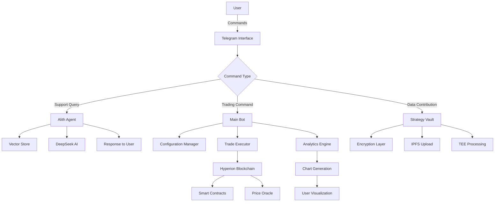

# LazaiTrader 🚀

**AI-Powered Decentralized Trading Assistant on Hyperion Testnet**

LazaiTrader is an intelligent trading assistant that combines AI-powered automation with community-driven strategy optimization. Built on the Hyperion testnet, it offers a complete trading experience through Telegram with advanced features like the Strategy Vault, real-time analytics, and AI-driven support.

## 🎯 Key Features

### 🤖 Intelligent Trading
- **Automated Martingale Strategy**: Dynamic buy-low, sell-high with consecutive trade multipliers
- **Multi-Pair Support**: Trade tgMetis-USDC, tgETH-USDC, and more
- **Real-Time Execution**: Blockchain-integrated smart contract trading
- **Risk Management**: Configurable trade percentages, triggers, and safety limits

### 🧠 AI-Powered Support
- **Alith Support Agent**: LangChain-powered customer support with document intelligence
- **Strategy Vault**: Secure, privacy-preserving community strategy sharing
- **Personalized Suggestions**: AI recommendations based on collective performance data
- **Vector-Based Knowledge**: GitHub documentation integration with semantic search

### 📊 Advanced Analytics
- **Real-Time Charts**: Multi-pair trading visualization with PnL tracking
- **Trade History**: Comprehensive logging with USD value tracking
- **Performance Metrics**: Detailed balance and trade value analysis
- **Export Capabilities**: Data contribution to decentralized analytics

### 🔒 Security & Privacy
- **TEE Integration**: Trusted Execution Environment for secure data processing
- **Wallet-Signed Encryption**: User-controlled data privacy
- **Testnet Safety**: Risk-free testing environment
- **Decentralized Storage**: IPFS-based data distribution

## 🚀 Quick Start

### 1. Join the Ecosystem
```bash
# Main Trading Bot
https://t.me/LazaiTrader_bot

# AI Support Agent
https://t.me/LazaiTrader_alithbot

# Community Group
https://t.me/LazaiTrader
```

### 2. Get Your Funded Wallet
- Send `/start` to the bot
- Receive automatically funded testnet wallet:
  - 100 tgUSDC
  - 10,000,000 tgMetis
  - 0.1 testgETH

### 3. Configure Your Strategy
```
/config → Select Pair → Choose Risk Level → Fine-tune Parameters → Start Trading!
```

### 4. Monitor & Optimize
```bash
/chart        # View your trading performance
/contribute   # Add data to Strategy Vault
/suggestion   # Get AI recommendations
/balance      # Check wallet balances
```

## 🏗️ System Architecture

LazaiTrader employs a sophisticated multi-component architecture designed for scalability, security, and intelligence:

```
┌─────────────────────────────────────────────────────────────────┐
│                    LAZAITRADER ECOSYSTEM                        │
├─────────────────────────────────────────────────────────────────┤
│                                                                 │
│  ┌─────────────────┐    ┌─────────────────┐    ┌─────────────┐ │
│  │  ALITH SUPPORT  │    │  MAIN TRADING   │    │ BLOCKCHAIN  │ │
│  │     AGENT       │    │      BOT        │    │ INTEGRATION │ │
│  │                 │    │                 │    │             │ │
│  │ • LangChain     │    │ • User Mgmt     │    │ • Hyperion  │ │
│  │ • Vector Store  │    │ • Config Mgmt   │    │   Testnet   │ │
│  │ • GitHub Docs   │    │ • Trade Exec    │    │ • Smart     │ │
│  │ • DeepSeek AI   │    │ • Visualization │    │   Contracts │ │
│  │ • Memory Buffer │    │ • Strategy      │    │ • DEX       │ │
│  │                 │    │   Vault         │    │ • Oracle    │ │
│  └─────────────────┘    └─────────────────┘    └─────────────┘ │
│           │                       │                       │     │
│           └───────────────────────┼───────────────────────┘     │
│                                   │                             │
│  ┌─────────────────────────────────────────────────────────┐   │
│  │              TELEGRAM INTERFACE                         │   │
│  │                                                         │   │
│  │  • Bot Commands        • Inline Keyboards              │   │
│  │  • Message Handling    • File Uploads                  │   │
│  │  • Chart Generation    • Real-time Notifications      │   │
│  └─────────────────────────────────────────────────────────┘   │
│                                   │                             │
│  ┌─────────────────────────────────────────────────────────┐   │
│  │              STRATEGY VAULT (TEE-SECURED)               │   │
│  │                                                         │   │
│  │  • Encrypted Data      • AI Analysis Engine            │   │
│  │  • IPFS Storage        • Privacy Protection            │   │
│  │  • Community Intel     • Personalized Suggestions     │   │
│  └─────────────────────────────────────────────────────────┘   │
└─────────────────────────────────────────────────────────────────┘
```

## 🔄 Data Flow Architecture




### Core Components

#### 1. **Main Trading Bot** (`plugins/main_bot.py`)
- **User Management**: Registration, wallet assignment, balance tracking
- **Configuration System**: Interactive strategy setup with risk profiles
- **Trading Execution**: Automated martingale strategy with multipliers
- **Analytics**: Chart generation, PnL calculation, performance tracking
- **Strategy Vault**: Secure data contribution and AI-powered suggestions

#### 2. **Alith Support Agent** (`plugins/alith_bot.py`)
- **Document Intelligence**: GitHub documentation integration
- **Vector Storage**: MilvusStore for efficient knowledge retrieval
- **AI Conversation**: DeepSeek-powered contextual responses
- **Memory Management**: Conversation history and context preservation

#### 3. **Trading Engine** (`main.py`)
- **Price Monitoring**: Multi-source price feeds (DexScreener, CoinGecko)
- **Trade Execution**: Smart contract integration with DEX
- **Risk Management**: Configurable safety limits and multipliers
- **Oracle Updates**: Real-time price feed updates for trading pairs

## 📋 Installation & Setup  - !!! THIS IS NOT REQUIRED TO USERS - ONLY FOR DEVELOPERS FORKING THIS REPOSITORY !!!

### Prerequisites
```bash
Python >= 3.8
Node.js >= 16 (for IPFS integration)
Git
```

### Environment Setup

1. **Clone Repository**
```bash
git clone https://github.com/smartonstuff/LazaiTrader.git
cd LazaiTrader
```

2. **Install Dependencies**
```bash
pip install -r requirements.txt
```

3. **Environment Configuration**
Create `.env` file:
```bash
# Telegram Bot Tokens
TELEGRAM_BOT_TOKEN=your_main_bot_token
TELEGRAM_BOT_TOKEN_ALITH=your_alith_bot_token

# Blockchain Configuration
RPC_URL=https://hyperion-testnet.metisdevops.link
CHAIN_ID=133717
ORACLE_OWNER_PK=your_oracle_private_key

# AI & API Keys
DEEPSEEK_API_KEY=your_deepseek_api_key
DEEPSEEK_API_URL=https://api.deepseek.com/v1/chat/completions
GITHUB_ACCESS_KEY=your_github_access_token

# IPFS Configuration
IPFS_JWT=your_pinata_jwt_token

# Production Flag
PRODUCTION=0  # Set to 1 for production trading
```

4. **Configuration Files**
Create `config/` directory with:
- `users.json` - User registrations
- `config.json` - Trading configurations  
- `tokens.json` - Token contract addresses
- `wallets.json` - Wallet private keys

5. **Wallet Setup**
Add funded wallet addresses to `plugins/addresses.txt`:
```
0x1234567890123456789012345678901234567890
0x2345678901234567890123456789012345678901
...
```

### Running the System

```bash
# Start Alith Support Agent
python plugins/alith_bot.py &

# Start Main Trading Bot
python plugins/main_bot.py &

# Start Trading Engine (for automated execution)
python main.py

# Or run as cron job for regular execution
# */5 * * * * cd /path/to/LazaiTrader && python main.py
```

## 🎮 User Guide

### Getting Started

#### 1. **Registration & Wallet**
```bash
/start          # Register and get funded wallet
/wallet         # View your wallet address
/balance        # Check token balances
```

#### 2. **Strategy Configuration**
```bash
/config         # Interactive strategy setup
/myconfig       # View active configurations
/deleteconfig   # Remove configurations
```

**Configuration Options:**
- **Trading Pairs**: tgMetis-USDC, tgETH-USDC
- **Risk Profiles**: Conservative (5%/5%/$20) or Aggressive (20%/15%/$100)
- **Fine-tuning**: Adjust trade percentage, trigger percentage, max amounts

#### 3. **Analytics & Optimization**
```bash
/chart          # View trading charts and PnL
/contribute     # Add data to Strategy Vault
/suggestion     # Get AI strategy recommendations
```

#### 4. **Community Support**
```bash
# Use @LazaiTrader_alithbot for:
# • Strategy advice
# • Technical questions
# • Command help
# • Troubleshooting
```

### Trading Strategy Explained

**Martingale Strategy with Multipliers:**
1. **Base Trigger**: Price moves by trigger_percentage (e.g., ±5%)
2. **Trade Execution**: Use trade_percentage of wallet (e.g., 5%)
3. **Consecutive Multiplier**: 1.5x increase for same-direction trades
4. **Safety Limits**: Max trade amounts and minimum thresholds

**Example Flow:**
```
Price drops 5% → Buy $10 worth of tgMetis
Price drops 5% again → Buy $15 worth (1.5x multiplier)  
Price drops 5% again → Buy $22.50 worth (1.5x multiplier)
Price recovers 5% → Sell $22.50 worth
Price recovers 5% → Sell $15 worth
```

## 🔧 Configuration Files

### `config/tokens.json`
```json
{
  "tokens": {
    "tgMetis": {
      "address": "0x69Dd3C70Ae76256De7Ec9AF5893DEE49356D45fc",
      "decimals": 18,
      "symbol": "tgMetis"
    },
    "tgUSDC": {
      "address": "0x6Eb66c8bBD57FdA71ecCAAc40a56610C2CA8FDb8",
      "decimals": 18,
      "symbol": "tgUSDC"
    }
  },
  "pairs": {
    "tgMetis-tgUSDC": {
      "dex_address": "0x4704759E4a426b29615e4841B092357460925eFf",
      "price_source": "dexscreener",
      "price_api": "https://api.dexscreener.com/latest/dex/pairs/metis/0xb7af89d7fe88d4fa3c9b338a0063359196245eaa"
    }
  }
}
```

### `config/config.json`
```json
{
  "trading_pairs": [
    {
      "userID": "telegram_user_id",
      "symbol1": "tgMetis",
      "symbol2": "tgUSDC",
      "trade_percentage": 0.05,
      "trigger_percentage": 0.05,
      "max_amount": 20.0,
      "minimum_amount": 0.0,
      "multiplier": 1.5
    }
  ]
}
```

## 🤖 AI Support Agent

### Features
- **Document Intelligence**: Automated loading from GitHub repository
- **Vector Search**: Semantic search across documentation
- **Contextual Memory**: Maintains conversation history
- **Personality**: Support-focused, non-sales approach

### Technical Implementation
```python
# Vector Store Creation
def create_vector_store():
    raw_docs = GithubFileLoader(
        repo="smartonstuff/LazaiTrader",
        access_token=GITHUB_ACCESS_KEY,
        file_filter=lambda file_path: re.match(
            f"docs/.*\\.mdx?", file_path
        ) is not None,
    ).load()
    
    text_chunks = []
    for doc in raw_docs:
        chunks = chunk_text(doc.page_content.strip(), overlap_percent=0.2)
        text_chunks.extend(chunks)
    
    return MilvusStore().save_docs(text_chunks)
```

### Usage
```bash
# Direct interaction with support agent
https://t.me/LazaiTrader_alithbot

# Or within community group
@LazaiTrader group → mention the Alith agent
```

## 📊 Strategy Vault

### Revolutionary Data Sharing System

The Strategy Vault enables secure, privacy-preserving strategy optimization through community intelligence:

#### Key Features
- **TEE Security**: Trusted Execution Environment processing
- **Wallet-Signed Encryption**: User-controlled data privacy
- **Anonymous Analytics**: Collective intelligence without identity exposure
- **AI Recommendations**: Personalized suggestions based on performance data

#### Usage Flow
```bash
1. /contribute    # Encrypt and upload your trading data
2. Wait 24h       # Cooldown period for data quality
3. /suggestion    # Get AI-powered strategy recommendations
4. Optimize       # Apply suggestions to improve performance
5. Repeat         # Continuous improvement cycle
```

#### Technical Process
```python
# Data Contribution
async def data_contribution():
    # 1. Collect trading data and configuration
    # 2. Encrypt using wallet signature
    # 3. Upload to IPFS
    # 4. Register with LazAI network
    # 5. Generate proofs and claim rewards

# AI Suggestions
async def get_suggestion():
    # 1. Load user's private data
    # 2. Access anonymized collective data
    # 3. Get AI-powered strategy recommendations
    # 4. Return personalized recommendations
```

## 🏆 Spotlight Campaign

### **Timeline**: Until August 21, 2025

### **Current Prize Pool**: $100
- **1st Place**: $50 (highest wallet USD value)
- **2nd Place**: $25
- **3rd Place**: $25

### **Potential Prize Pool**: $500*
*If LazaiTrader wins Hyperhack rewards:
- **Core Prizes Doubled**: 1st = $100, 2nd = $50, 3rd = $50
- **Bonus Winners**: +10 winners get $30 in ETH/METIS/USDC
- **Distribution**: On Hyperion mainnet with withdrawals enabled

### **How to Win**
1. **Strategic Configuration**: Choose optimal risk levels and parameters
2. **Multi-Pair Trading**: Test both tgMetis-USDC and tgETH-USDC
3. **Strategy Vault**: Contribute data and use AI suggestions for optimization
4. **Community Engagement**: Learn from @LazaiTrader group discussions
5. **Performance Tracking**: Monitor progress with `/chart` and `/balance`

## 🔒 Security & Privacy

### Multi-Layer Protection

#### 1. **Testnet Safety**
- No real funds at risk
- Admin-controlled wallets during testing
- Safe learning environment

#### 2. **Data Encryption**
```python
# Wallet-signed encryption
encryption_seed = "Sign to retrieve your encryption key"
message = encode_defunct(text=encryption_seed)
password = client.wallet.sign_message(message).signature.hex()
encrypted_data = encrypt(privacy_data.encode(), password)
```

#### 3. **TEE Integration**
- Trusted Execution Environment for sensitive processing
- Anonymous data analysis without privacy exposure
- Secure multi-party computation capabilities

#### 4. **Access Controls**
- 24-hour cooldown periods for data contributions
- User-isolated data storage
- Permission-based feature access

## 🛠️ API Reference

### Main Bot Commands

#### User Management
| Command     | Description                          |
|-------------|--------------------------------------|
| `/start`    | Register and receive funded wallet   |
| `/wallet`   | Display wallet address               |
| `/address`  | Alternative wallet display           |
| `/balance`  | Show token balances                  |

#### Configuration
| Command        | Description                        |
|----------------|------------------------------------|
| `/config`      | Interactive strategy setup         |
| `/myconfig`    | View active configurations         |
| `/deleteconfig`| Remove configurations              |

#### Analytics
| Command        | Description                        |
|----------------|------------------------------------|
| `/chart`       | Generate trading charts            |
| `/contribute`  | Add data to Strategy Vault         |
| `/suggestion`  | Get AI recommendations             |

#### Utility
| Command     | Description                          |
|-------------|--------------------------------------|
| `/withdraw` | Withdrawal info (mainnet only)       |
| `/cancel`   | Cancel active conversation           |

### Alith Agent Integration
- **Direct Chat**: https://t.me/LazaiTrader_alithbot
- **Group Support**: Mention in @LazaiTrader group
- **Context-Aware**: Maintains conversation history
- **Document-Backed**: Responses based on official documentation

## 📈 Performance & Monitoring

### Chart Features
- **Multi-Pair Visualization**: Combined view of all trading pairs
- **PnL Calculation**: Real-time profit/loss tracking  
- **Trade Markers**: Visual buy/sell indicators
- **Balance Tracking**: USD value evolution over time

### Log Structure
```
logs/
├── trading_main.log           # Successful operations
├── trading_errors.log         # Error tracking
├── tgMetis_tgUSDC_user.csv   # Price history
├── tgMetis_tgUSDC_user_trades.csv  # Trade details
└── charts/                    # Generated visualizations
```

### Metrics Tracked
- **Trade Frequency**: Number of trades per time period
- **Success Rate**: Profitable vs unprofitable trades
- **Balance Evolution**: USD value changes over time
- **Strategy Performance**: Comparison across configurations

## 🚀 Roadmap

### Phase 1: Enhanced Security (Q4 2025)
- **Wallet PK Reveal**: User-controlled private key access
- **Privacy Withdrawals**: Compliant privacy layer for Hyperion

### Phase 2: Advanced Trading (Q1 2026)
- **Social Sentiment Signals**: Market sentiment integration
- **Bull/Bear Triggers**: Custom market condition responses
- **Strategy Auto-Upgrades**: Continuous improvement algorithms

### Phase 3: Community Features (Q2 2026)
- **Enhanced Vault**: Advanced analytics and insights
- **Multi-Network**: Expansion to other blockchain networks

### Phase 4: Enterprise (Q3-4 2025)
- **Institutional Features**: Advanced risk management
- **API Access**: Programmatic trading interfaces
- **White-Label Solutions**: Custom deployment options

## 🤝 Contributing

### Development Setup
```bash
# Fork repository
git clone https://github.com/yourusername/LazaiTrader.git

# Create feature branch
git checkout -b feature/your-feature-name

# Install development dependencies
pip install -r requirements-dev.txt

# Run tests
python -m pytest tests/

# Submit pull request
```

### Contribution Areas
- **Strategy Development**: New trading algorithms
- **AI Enhancement**: Improved recommendation systems
- **Security Audits**: Smart contract and system security
- **Documentation**: User guides and technical documentation
- **Testing**: Automated testing and quality assurance

### External Resources

- **Hyperion Testnet**: [https://hyperion.metis.io](https://hyperion.metis.io)
- **Metis Documentation**: [https://docs.metis.io](https://docs.metis.io)
- **LazAI Network**: [https://lazai.network](https://lazai.network)
- **LangChain**: [https://langchain.com](https://langchain.com)
- **Web3.py**: [https://web3py.readthedocs.io](https://web3py.readthedocs.io)

## ❓ FAQ

**Q: Is real money involved during testing?**
A: No, all testing uses testnet tokens with no real value.

**Q: How does the Strategy Vault protect privacy?**
A: Data is encrypted with your wallet signature and processed anonymously in TEE.

**Q: Which trading pair should I choose?**
A: Try both! tgMetis-USDC offers meme token volatility, tgETH-USDC provides traditional crypto dynamics.

**Q: How often does the bot trade?**
A: Only when prices move by your configured trigger percentage.

**Q: Can I change my strategy?**
A: Yes, use `/config` anytime or `/deleteconfig` to start fresh.

**Q: When will mainnet be available?**
A: check on https://Hyperion.metis.io for updates

## 🆘 Support

### Getting Help
1. **Alith AI Agent**: https://t.me/LazaiTrader_alithbot
2. **Community Group**: https://t.me/LazaiTrader
3. **Documentation**: Check this README and docs folder
4. **GitHub Issues**: Submit technical issues

### Common Issues - developers
- **Bot not responding**: Check token validity and network connection
- **Configuration errors**: Validate JSON syntax in config files
- **Trade execution issues**: Verify wallet balance and contract addresses
- **Chart generation problems**: Ensure pandas/matplotlib dependencies

### Error Reporting
```bash
# Check logs
tail -f logs/trading_errors.log

# Validate configuration
python -c "import json; print(json.load(open('config/tokens.json')))"

# Test connectivity
python -c "from web3 import Web3; w3 = Web3(Web3.HTTPProvider('https://hyperion-testnet.metisdevops.link')); print('Connected:', w3.is_connected())"
```

## 📄 License

This project is licensed under the MIT License - see the [LICENSE](LICENSE) file for details.

## 🙏 Acknowledgments

- **gMetis** for gMetis token and ecosystem support
- **Metis Andromeda** for ecosystem support and Hyperion testnet infrastructure
- **Lazai Network** for private data layer settlement infrastructure
- **DeepSeek AI** for intelligent conversation capabilities
- **LangChain** for document intelligence framework
- **Telegram** for bot platform and community features

---

**Built by gMetis using the Alith AI framework**

*Join the revolution in decentralized trading intelligence. Trade smart, learn collectively, win together.*

🚀 **Start your journey**: https://t.me/LazaiTrader_bot
