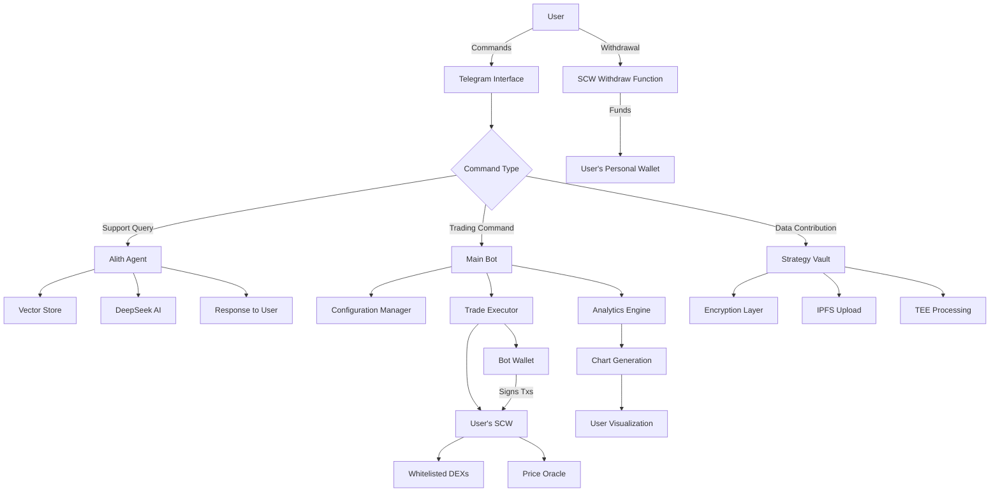

# LazaiTrader 🚀


**AI-Powered Non-Custodial Trading Assistant on Hyperion Testnet**

LazaiTrader is an intelligent trading assistant that combines AI-powered automation with community-driven strategy optimization. Built on the Hyperion testnet, it offers a complete **non-custodial** trading experience through Telegram with advanced features like the Strategy Vault, real-time analytics, and AI-driven support.


## 🎯 Key Features

### 🤖 Intelligent Trading
- **Automated Martingale Strategy**: Dynamic buy-low, sell-high with consecutive trade multipliers
- **Multi-Pair Support**: Trade tgMetis-USDC, tgETH-USDC, and more
- **Real-Time Execution**: Blockchain-integrated smart contract trading
- **Risk Management**: Configurable trade percentages, triggers, and safety limits

### 🔐 Non-Custodial Security
- **Smart Contract Wallets (SCW)**: You own your wallet, we just execute trades
- **User-Controlled Assets**: All funds remain in your control
- **Restricted Bot Access**: Bot can only trade on whitelisted DEXs
- **Withdraw Anytime**: Direct withdrawals to your personal wallet
- **No Private Keys Stored**: Zero custody of your funds

### 🧠 AI-Powered Support
- **Alith Support Agent**: LazaiNetwork's Alith-powered customer support with document intelligence
- **Strategy Vault**: Secure, privacy-preserving community strategy sharing
- **Personalized Suggestions**: AI recommendations based on collective performance data
- **Vector-Based Knowledge**: GitHub documentation integration with semantic search

### 📊 Advanced Analytics
- **Real-Time Charts**: Multi-pair trading visualization with PnL tracking
- **Trade History**: Comprehensive logging with USD value tracking
- **Performance Metrics**: Detailed balance and trade value analysis
- **Export Capabilities**: Data contribution to decentralized analytics

### 🔒 Security & Privacy
- **TEE Integration**: Trusted Execution Environment for secure data processing
- **Testnet Safety**: Risk-free testing environment
- **Decentralized Storage**: IPFS-based data distribution

## 🚀 Quick Start

### 1. Join the Ecosystem
```bash
# Main Trading Bot
https://t.me/LazaiTrader_bot

# AI Support Agent
https://t.me/LazaiTrader_alithbot

# Community Group
https://t.me/LazaiTrader
```

### 2. Get Your Non-Custodial Wallet
- Send `/start` to the bot
- Provide your wallet address (or let us create one for you)
- Receive your Smart Contract Wallet (SCW) address
- Get automatically funded with testnet tokens:
  - 100 tgUSDC
  - 10,000,000 tgMetis
  - 0.1 testgETH

**Important**: Your SCW is controlled by YOU. We can only execute trades on whitelisted DEXs.

### 3. Configure Your Strategy
```
/config → Select Pair → Choose Risk Level → Fine-tune Parameters → Start Trading!
```

### 4. Monitor & Optimize
```bash
/chart        # View your trading performance
/contribute   # Add data to Strategy Vault
/suggestion   # Get AI recommendations
/balance      # Check SCW balances
/withdraw     # Withdraw funds to your personal wallet
```

## 🏗️ System Architecture

LazaiTrader employs a sophisticated multi-component architecture designed for scalability, security, and intelligence with **non-custodial** wallet management:

```
┌─────────────────────────────────────────────────────────────────┐
│                    LAZAITRADER ECOSYSTEM                        │
├─────────────────────────────────────────────────────────────────┤
│                                                                 │
│  ┌─────────────────┐    ┌─────────────────┐    ┌─────────────┐ │
│  │  ALITH SUPPORT  │    │  MAIN TRADING   │    │ BLOCKCHAIN  │ │
│  │     AGENT       │    │      BOT        │    │ INTEGRATION │ │
│  │                 │    │                 │    │             │ │
│  │ • LangChain     │    │ • User Mgmt     │    │ • Hyperion  │ │
│  │ • Vector Store  │    │ • Config Mgmt   │    │   Testnet   │ │
│  │ • GitHub Docs   │    │ • Trade Exec    │    │ • SCW       │ │
│  │ • DeepSeek AI   │    │ • Visualization │    │   Factory   │ │
│  │ • Memory Buffer │    │ • Strategy      │    │ • DEX       │ │
│  │                 │    │   Vault         │    │ • Oracle    │ │
│  └─────────────────┘    └─────────────────┘    └─────────────┘ │
│           │                       │                       │     │
│           └───────────────────────┼───────────────────────┘     │
│                                   │                             │
│  ┌─────────────────────────────────────────────────────────┐   │
│  │              TELEGRAM INTERFACE                         │   │
│  │                                                         │   │
│  │  • Bot Commands        • Inline Keyboards              │   │
│  │  • Message Handling    • File Uploads                  │   │
│  │  • Chart Generation    • Real-time Notifications      │   │
│  └─────────────────────────────────────────────────────────┘   │
│                                   │                             │
│  ┌─────────────────────────────────────────────────────────┐   │
│  │        SMART CONTRACT WALLET LAYER (NON-CUSTODIAL)      │   │
│  │                                                         │   │
│  │  • User Ownership      • Restricted Bot Access         │   │
│  │  • DEX Whitelist       • Direct Withdrawals            │   │
│  │  • Trade Execution     • Zero Custody                  │   │
│  └─────────────────────────────────────────────────────────┘   │
│                                   │                             │
│  ┌─────────────────────────────────────────────────────────┐   │
│  │              STRATEGY VAULT (TEE-SECURED)               │   │
│  │                                                         │   │
│  │  • Encrypted Data      • AI Analysis Engine            │   │
│  │  • IPFS Storage        • Privacy Protection            │   │
│  │  • Community Intel     • Personalized Suggestions     │   │
│  └─────────────────────────────────────────────────────────┘   │
└─────────────────────────────────────────────────────────────────┘
```

## 🔄 Data Flow Architecture



## 🔐 Non-Custodial Architecture

### Smart Contract Wallet (SCW) Design

```solidity
// LazaiTradingWallet.sol - Simplified Structure
contract LazaiTradingWallet {
    address public immutable owner;         // User's EOA (YOU)
    address public immutable botOperator;   // Bot's wallet (trades only)
    address public immutable factory;       // DEX whitelist manager
    
    // ✅ Bot CAN: Execute trades on whitelisted DEXs
    function executeTrade(address _dex, bytes calldata _data) 
        external onlyBotOperator onlyWhitelistedDEX;
    
    // ✅ Bot CAN: Approve tokens for whitelisted DEXs
    function approveToken(address _token, address _dex, uint256 _amount)
        external onlyBotOperator onlyWhitelistedDEX;
    
    // ✅ User & Bot CAN: Withdraw to owner's wallet
    function withdrawAll(address _token)
        external onlyBotOrOwner;
    
    // ❌ Bot CANNOT: Trade on non-whitelisted DEXs
    // ❌ Bot CANNOT: Transfer funds to arbitrary addresses
    // ❌ Bot CANNOT: Prevent owner withdrawals
}
```

### Security Model

**What the Bot CAN do:**
- ✅ Execute trades on whitelisted DEXs only
- ✅ Approve tokens for whitelisted DEXs only
- ✅ Check balances
- ✅ Initiate withdrawals to your wallet

**What the Bot CANNOT do:**
- ❌ Access your private keys
- ❌ Trade on non-whitelisted exchanges
- ❌ Transfer your funds to arbitrary addresses
- ❌ Prevent you from withdrawing
- ❌ Change the owner of your SCW

**What YOU can do:**
- ✅ Withdraw all funds anytime
- ✅ Own your Smart Contract Wallet
- ✅ Control your assets completely
- ✅ View all transactions on-chain

### Core Components

#### 1. **Main Trading Bot** (`plugins/main_bot.py`)
- **User Management**: Registration, SCW deployment, balance tracking
- **Configuration System**: Interactive strategy setup with risk profiles
- **Trading Execution**: Automated martingale strategy via SCW
- **Analytics**: Chart generation, PnL calculation, performance tracking
- **Strategy Vault**: Secure data contribution and AI-powered suggestions

#### 2. **Alith Support Agent** (`plugins/alith_bot.py`)
- **Document Intelligence**: GitHub documentation integration
- **Vector Storage**: MilvusStore for efficient knowledge retrieval
- **AI Conversation**: DeepSeek-powered contextual responses
- **Memory Management**: Conversation history and context preservation

#### 3. **Trading Engine** (`main.py`)
- **Price Monitoring**: Multi-source price feeds (DexScreener, CoinGecko)
- **SCW Trade Execution**: Non-custodial smart contract integration
- **Risk Management**: Configurable safety limits and multipliers
- **Oracle Updates**: Real-time price feed updates for trading pairs

#### 4. **Smart Contract Wallet System**
- **Factory Contract**: Deploys and manages user SCWs
- **DEX Whitelist**: Controls which exchanges can be used
- **Bot Operator**: Limited execution permissions
- **User Ownership**: Complete control with withdrawal rights

## 📋 Installation & Setup - !!! THIS IS NOT REQUIRED FOR USERS - ONLY FOR DEVELOPERS FORKING THIS REPOSITORY !!!

### Prerequisites
```bash
Python >= 3.8
Node.js >= 16 (for IPFS integration)
Git
Solidity compiler (for smart contract deployment)
```

### Environment Setup

1. **Clone Repository**
```bash
git clone https://github.com/smartonstuff/LazaiTrader.git
cd LazaiTrader
```

2. **Install Dependencies**
```bash
pip install -r requirements.txt
```

3. **Environment Configuration**
Create `.env` file:
```bash
# Telegram Bot Tokens
TELEGRAM_BOT_TOKEN=your_main_bot_token
TELEGRAM_BOT_TOKEN_ALITH=your_alith_bot_token

# Blockchain Configuration
RPC_URL=https://hyperion-testnet.metisdevops.link
CHAIN_ID=133717
ORACLE_OWNER_PK=your_oracle_private_key

# Bot Wallet Configuration (NON-CUSTODIAL)
BOT_WALLET_PRIVATE_KEY=your_bot_operator_key  # Signs SCW transactions only

# Smart Contract Addresses
SCW_FACTORY_ADDRESS=your_factory_contract_address

# AI & API Keys
DEEPSEEK_API_KEY=your_deepseek_api_key
DEEPSEEK_API_URL=https://api.deepseek.com/v1/chat/completions
GITHUB_ACCESS_KEY=your_github_access_token

# IPFS Configuration
IPFS_JWT=your_pinata_jwt_token

# Production Flag
PRODUCTION=0  # Set to 1 for production trading
```

4. **Configuration Files**
Create `config/` directory with:
- `users.json` - User registrations with SCW addresses
  ```json
  {
    "users": {
      "telegram_id": {
        "user_wallet": "0x...",      // User's personal EOA
        "scw_address": "0x...",      // User's SCW contract
        "telegram_chat_id": "...",
        "username": "...",
        "registered_at": "..."
      }
    }
  }
  ```
- `config.json` - Trading configurations  
- `tokens.json` - Token contract addresses and DEX pairs

**Note**: `wallets.json` is **NO LONGER USED** - we don't store user private keys!

5. **Smart Contract Deployment**
Deploy the SCW Factory contract:
```bash
# Deploy Factory with DEX whitelist
# Deploy SCW for each user via Factory
# Configure bot operator address
```

### Running the System

```bash
# Start Main Trading Bot
python plugins/main_bot.py

# Start Alith Support Agent
python plugins/alith_bot.py

# Run scheduled trading execution
python main.py

# Run all with process manager (recommended)
pm2 start ecosystem.config.js
```

## 🔧 Technical Details

### Non-Custodial Trading Flow

```python
# 1. User registration creates SCW
async def register_user(telegram_id, user_wallet):
    # Deploy SCW via Factory
    scw_address = factory.createWallet(user_wallet, bot_operator)
    
    # Store in users.json
    users_data[telegram_id] = {
        'user_wallet': user_wallet,
        'scw_address': scw_address,
        ...
    }

# 2. Bot executes trade through SCW (not directly)
def execute_dex_trade(w3, base_asset, quote_asset, action, quantity, user_data):
    # Load bot account (signs transactions)
    bot_account = get_bot_account(w3)
    
    # Load user's SCW
    scw_contract = w3.eth.contract(address=user_data['scw_address'], abi=SCW_ABI)
    
    # Step 1: Approve token via SCW
    scw_contract.functions.approveToken(token, dex, amount).build_transaction({
        'from': bot_account.address,  # Bot signs
        ...
    })
    
    # Step 2: Execute trade via SCW
    swap_data = dex_contract.functions.swap(token_in, amount_in).encode()
    scw_contract.functions.executeTrade(dex, swap_data).build_transaction({
        'from': bot_account.address,  # Bot signs
        ...
    })

# 3. Balance checking from SCW
def get_balances(w3, base_asset, quote_asset, scw_address):
    scw_contract = w3.eth.contract(address=scw_address, abi=SCW_ABI)
    base_balance = scw_contract.functions.getTokenBalance(base_token).call()
    quote_balance = scw_contract.functions.getTokenBalance(quote_token).call()
    return base_balance, quote_balance
```

### Strategy Vault Integration

```python
# Data Contribution (Privacy-Preserving)
async def contribute_data():
    # 1. Collect trading data from SCW
    # 2. Encrypt using wallet signature
    # 3. Upload to IPFS
    # 4. Register with LazAI network
    # 5. Generate proofs and claim rewards

# AI Suggestions
async def get_suggestion():
    # 1. Load user's private data
    # 2. Access anonymized collective data
    # 3. Get AI-powered strategy recommendations
    # 4. Return personalized recommendations
```

## 🔒 Security & Privacy

### Multi-Layer Protection

#### 1. **Non-Custodial Security**
- Smart Contract Wallets with restricted bot access
- User owns private keys to their EOA
- Bot cannot access user funds outside trading
- Transparent on-chain transaction history

#### 2. **Testnet Safety**
- No real funds at risk
- Safe learning environment
- Full feature testing without financial risk

#### 3. **Data Encryption**
```python
# Wallet-signed encryption
encryption_seed = "Sign to retrieve your encryption key"
message = encode_defunct(text=encryption_seed)
password = client.wallet.sign_message(message).signature.hex()
encrypted_data = encrypt(privacy_data.encode(), password)
```

#### 4. **TEE Integration**
- Trusted Execution Environment for sensitive processing
- Anonymous data analysis without privacy exposure
- Secure multi-party computation capabilities

#### 5. **Access Controls**
- 24-hour cooldown periods for data contributions
- User-isolated data storage
- Permission-based feature access
- Whitelisted DEX enforcement

## 🛠️ API Reference

### Main Bot Commands

#### User Management
| Command     | Description                          |
|-------------|--------------------------------------|
| `/start`    | Register and receive SCW address     |
| `/wallet`   | Display your SCW address             |
| `/address`  | Alternative SCW display              |
| `/balance`  | Show token balances in your SCW      |

#### Configuration
| Command        | Description                        |
|----------------|------------------------------------|
| `/config`      | Interactive strategy setup         |
| `/myconfig`    | View active configurations         |
| `/deleteconfig`| Remove configurations              |

#### Analytics
| Command        | Description                        |
|----------------|------------------------------------|
| `/chart`       | Generate trading charts            |
| `/contribute`  | Add data to Strategy Vault         |
| `/suggestion`  | Get AI recommendations             |

#### Utility
| Command     | Description                          |
|-------------|--------------------------------------|
| `/withdraw` | Withdraw funds to your wallet        |
| `/cancel`   | Cancel active conversation           |

### Alith Agent Integration
- **Direct Chat**: https://t.me/LazaiTrader_alithbot
- **Group Support**: Mention in @LazaiTrader group
- **Context-Aware**: Maintains conversation history
- **Document-Backed**: Responses based on official documentation

## 📈 Performance & Monitoring

### Chart Features
- **Multi-Pair Visualization**: Combined view of all trading pairs
- **PnL Calculation**: Real-time profit/loss tracking  
- **Trade Markers**: Visual buy/sell indicators
- **Balance Tracking**: USD value evolution over time
- **SCW Balance Integration**: Tracks funds in your Smart Contract Wallet

### Log Structure
```
logs/
├── trading_main.log           # Successful operations
├── trading_errors.log         # Error tracking
├── tgMetis_tgUSDC_user.csv   # Price history
├── tgMetis_tgUSDC_user_trades.csv  # Trade details
└── charts/                    # Generated visualizations
```

### Metrics Tracked
- **Trade Frequency**: Number of trades per time period
- **Success Rate**: Profitable vs unprofitable trades
- **Balance Evolution**: USD value changes over time
- **Strategy Performance**: Comparison across configurations
- **Gas Costs**: Transaction fees paid by bot operator

## 🚀 Roadmap

### Phase 1: Enhanced Non-Custodial Features (Q4 2025)
- **Multi-Signature Support**: Enhanced security for large balances
- **Custom DEX Whitelisting**: User-controlled exchange permissions
- **Advanced Withdrawal Options**: Scheduled and conditional withdrawals

### Phase 2: Advanced Trading (Q1 2026)
- **Social Sentiment Signals**: Market sentiment integration
- **Bull/Bear Triggers**: Custom market condition responses
- **Strategy Auto-Upgrades**: Continuous improvement algorithms
- **Cross-Chain SCW**: Multi-network smart contract wallets

### Phase 3: Community Features (Q2 2026)
- **Enhanced Vault**: Advanced analytics and insights
- **Multi-Network**: Expansion to other blockchain networks
- **Governance**: Community-driven DEX whitelisting

### Phase 4: Enterprise (Q3-Q4 2026)
- **Institutional SCW**: Advanced risk management for institutions
- **API Access**: Programmatic trading interfaces
- **White-Label Solutions**: Custom deployment options

## 🤝 Contributing

### Development Setup
```bash
# Fork repository
git clone https://github.com/yourusername/LazaiTrader.git

# Create feature branch
git checkout -b feature/your-feature-name

# Install development dependencies
pip install -r requirements-dev.txt

# Run tests
python -m pytest tests/

# Submit pull request
```

### Contribution Areas
- **Strategy Development**: New trading algorithms
- **AI Enhancement**: Improved recommendation systems
- **Security Audits**: Smart contract and system security
- **Documentation**: User guides and technical documentation
- **Testing**: Automated testing and quality assurance
- **Smart Contract Development**: SCW enhancements

### External Resources

- **Hyperion Testnet**: [https://hyperion.metis.io](https://hyperion.metis.io)
- **Metis Documentation**: [https://docs.metis.io](https://docs.metis.io)
- **LazAI Network**: [https://lazai.network](https://lazai.network)
- **LangChain**: [https://langchain.com](https://langchain.com)
- **Web3.py**: [https://web3py.readthedocs.io](https://web3py.readthedocs.io)
- **OpenZeppelin Contracts**: [https://docs.openzeppelin.com/contracts](https://docs.openzeppelin.com/contracts)

## ❓ FAQ

**Q: Who controls my funds?**
A: YOU do! Your funds are in a Smart Contract Wallet that YOU own. The bot can only execute trades on whitelisted DEXs.

**Q: Can the bot steal my funds?**
A: No. The bot cannot transfer your funds to arbitrary addresses or prevent you from withdrawing.

**Q: What happens if I want to stop trading?**
A: Simply use `/withdraw` to move all funds back to your personal wallet anytime.

**Q: Is real money involved during testing?**
A: No, all testing uses testnet tokens with no real value.

**Q: How does the Strategy Vault protect privacy?**
A: Data is encrypted with your wallet signature and processed anonymously in TEE.

**Q: Which trading pair should I choose?**
A: Try both! tgMetis-USDC offers meme token volatility, tgETH-USDC provides traditional crypto dynamics.

**Q: How often does the bot trade?**
A: Only when prices move by your configured trigger percentage.

**Q: Can I change my strategy?**
A: Yes, use `/config` anytime or `/deleteconfig` to start fresh.

**Q: What are the gas costs?**
A: The bot operator pays gas fees for trade execution. You only pay gas when withdrawing.

**Q: Can I use my existing wallet?**
A: Yes! Provide your wallet address during registration, and we'll deploy an SCW connected to it.

**Q: When will mainnet be available?**
A: Check https://Hyperion.metis.io for updates

## 🆘 Support

### Getting Help
1. **Alith AI Agent**: https://t.me/LazaiTrader_alithbot
2. **Community Group**: https://t.me/LazaiTrader
3. **Documentation**: Check this README and docs folder
4. **GitHub Issues**: Submit technical issues

### Common Issues - Developers
- **Bot not responding**: Check token validity and network connection
- **Configuration errors**: Validate JSON syntax in config files
- **Trade execution issues**: Verify SCW balance and contract addresses
- **Chart generation problems**: Ensure pandas/matplotlib dependencies
- **SCW deployment fails**: Check factory contract address and bot operator setup

### Error Reporting
```bash
# Check logs
tail -f logs/trading_errors.log

# Validate configuration
python -c "import json; print(json.load(open('config/tokens.json')))"

# Test connectivity
python -c "from web3 import Web3; w3 = Web3(Web3.HTTPProvider('https://hyperion-testnet.metisdevops.link')); print('Connected:', w3.is_connected())"

# Verify SCW deployment
python -c "from web3 import Web3; w3 = Web3(Web3.HTTPProvider('https://hyperion-testnet.metisdevops.link')); print('SCW Code:', w3.eth.get_code('YOUR_SCW_ADDRESS'))"
```

## 📄 License

This project is licensed under the MIT License - see the [LICENSE](LICENSE) file for details.

## 🙏 Acknowledgments

- **gMetis** for gMetis token and ecosystem support
- **Metis Andromeda** for ecosystem support and Hyperion testnet infrastructure
- **Lazai Network** for private data layer settlement infrastructure
- **DeepSeek AI** for intelligent conversation capabilities
- **LangChain** for document intelligence framework
- **Telegram** for bot platform and community features
- **OpenZeppelin** for secure smart contract libraries

---

**Built by gMetis using the Alith AI framework**

*Trade smart with full control. Non-custodial, secure, intelligent.*

🚀 **Start your journey**: https://t.me/LazaiTrader_bot

🔐 **Your keys, your funds, your control.**
